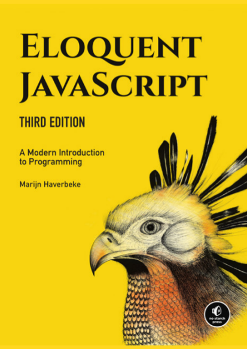

# Eloquent JavaScript 3RD Edition 

## Part 1: Language
 1. Values, Types, and Operators
 2. Program Structure
 3. Functios
 4. Data Structures: Objects and Arrays
 5. Higher-order Functions
 6. The Secret Life Of Objects
 7. Project: A Robot
 8. Bugs and Errors
 9. Regular Expressions
 10. Modules
 11. Asynchronous Programming
 12. Project: A Programming Language

## Part 2: Browser
## Part 3: Node

_Fonte:_ https://eloquentjavascript.net/ (com adaptações).
